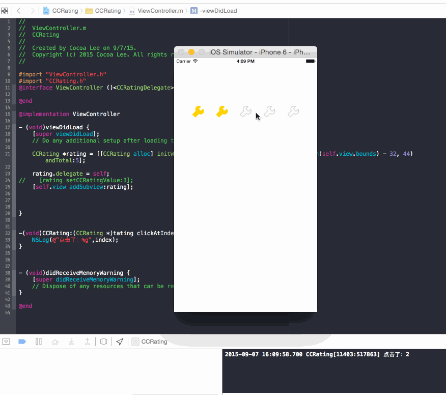

# CCRating
###简单的评分工具



###使用方式

```
    CCRating *rating = [[CCRating alloc] initWithFrame:CGRectMake(16, 120, CGRectGetWidth(self.view.bounds) - 32, 44) andTotal:5];
    rating.delegate = self;
    // 设置分数
    [rating setCCRatingValue:3];
    [self.view addSubview:rating];
    
    
```